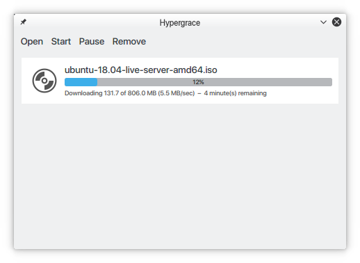

# Hypergrace

Hypergrace is a simple BitTorrent client. I wrote it in 2010 out of a sheer boredom and to try out new C++11 features (that were still experimental at the time). Expect some features to be broken or missing.



# Dependencies
 - Qt 4.x or 5.x
 - CMake (build-time only)

# Building

```console
$ git clone https://github.com/mhva/hypergrace.git
$ mkdir hypergrace-build
$ cd hypergrace-build
$ cmake ../hypergrace
$ make
```

# TODO

 - [ ] UDP and HTTPS tracker support.
 - [ ] uTP support.
 - [ ] Magnet links.
 - [ ] DHT support.
 - [ ] Improve GUI.